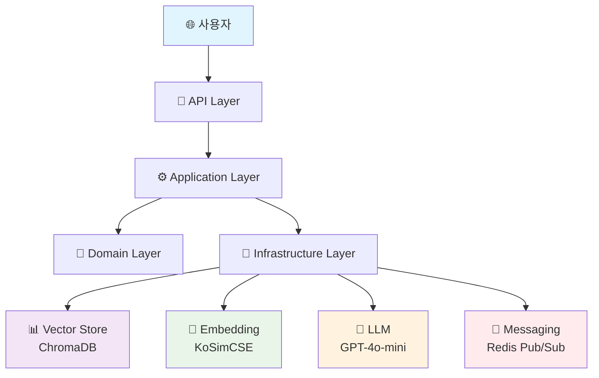
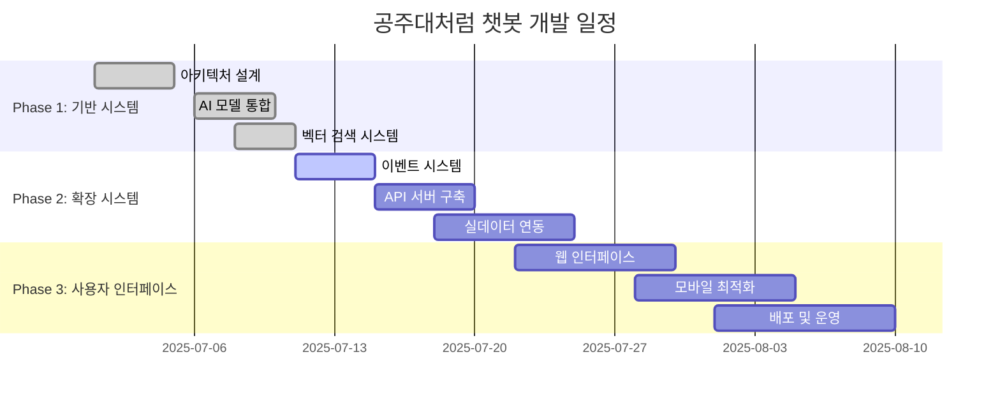

# 🎓 공주대처럼 - AI 챗봇

<div align="center">

[](https://python.org)
[](https://langchain.com)
[](https://www.trychroma.com)
[](https://openai.com)
[](https://redis.io)

**🚀 공주대학교 학생들을 위한 차세대 AI 챗봇**

*RAG(Retrieval Augmented Generation) + 이벤트 기반 아키텍처로 구현된 완전 작동 시스템*

</div>

---

## 🌟 주요 특징

<table>
<tr>
<td align="center" width="33%">

<h3>🧠 한국어 특화 AI</h3>
<p>KoSimCSE 모델로<br/>한국어 이해도 극대화</p>
</td>
<td align="center" width="33%">

<h3>⚡ 실시간 업데이트</h3>
<p>Redis Pub/Sub으로<br/>최신 정보 동기화</p>
</td>
<td align="center" width="33%">

<h3>🏫 캠퍼스별 맞춤</h3>
<p>신관/천안/예산<br/>캠퍼스 정보 필터링</p>
</td>
</tr>
</table>

### 📚 제공 정보

- 📢 **공지사항** - 학사/장학/도서관/모집/일반 공지 ✅
- 🍽️ **식단메뉴** - 캠퍼스별 식당 정보 🚧
- 🚌 **셔틀버스** - 실시간 운행 정보 🚧
- 📅 **학사일정** - 중요 일정 알림 🚧
- 🎯 **동아리 정보** - 활동 및 모집 정보 🚧

## ⚡ 빠른 시작

```bash
# 1. 리포지토리 클론
git clone https://github.com/your-username/like-knu-rag.git
cd like-knu-rag

# 2. 의존성 설치 (Python 3.11 권장)
pip install -r requirements.txt

# 3. 환경 변수 설정
echo "OPENAI_API_KEY=your_openai_api_key_here" > .env

# 4. 테스트 실행
python3.11 tests/test_rag.py
```

## 🛠️ 기술 스택

- **Python 3.11+** - 메인 개발 언어
- **LangChain 0.3+** - RAG 파이프라인 구축
- **ChromaDB 0.5+** - 벡터 데이터베이스 (임베디드 모드)
- **KoSimCSE** - 한국어 임베딩 (BM-K/KoSimCSE-roberta-multitask)
- **OpenAI GPT-4o-mini** - 답변 생성 모델
- **FastAPI** - REST API 서버 *(예정)*

## 🏗️ 아키텍처

<div align="center">



</div>

### 📁 프로젝트 구조 (클린 아키텍처)

```
📦 like-knu-rag/
├── 🎯 src/                          # 소스 코드
│   ├── 🏪 domain/                   # 도메인 레이어
│   │   ├── models/                  # 엔티티 & 값 객체
│   │   │   ├── notice.py           # 📋 공지사항 모델
│   │   │   ├── campus.py           # 🏫 캠퍼스 enum
│   │   │   └── common.py           # 📂 공통 타입
│   │   ├── repositories/           # 리포지토리 인터페이스
│   │   └── services/               # 도메인 서비스
│   ├── ⚙️ application/              # 애플리케이션 레이어
│   │   ├── dto/                    # 데이터 전송 객체
│   │   ├── processors/             # 문서 처리
│   │   │   ├── document_processor.py
│   │   │   └── text_splitter.py
│   │   └── services/               # 애플리케이션 서비스
│   │       └── rag_service.py      # 🤖 RAG 시스템 메인
│   ├── 🔧 infrastructure/           # 인프라 레이어
│   │   ├── embedding/              # 임베딩 모델
│   │   │   └── korean_embeddings.py
│   │   ├── vector_store/           # 벡터 DB
│   │   │   └── chroma_store.py
│   │   ├── messaging/              # 메시징 시스템
│   │   │   ├── events.py           # 이벤트 모델
│   │   │   ├── brokers/
│   │   │   │   └── redis_broker.py # Redis Pub/Sub
│   │   │   └── handlers/
│   │   │       └── notice_handler.py
│   │   └── repositories/           # 구현체
│   ├── 🌐 interfaces/               # 인터페이스 레이어
│   │   ├── api/                    # REST API (예정)
│   │   └── cli/                    # CLI (예정)
│   └── 🔄 shared/                   # 공유 레이어
│       ├── exceptions/             # 예외 처리
│       └── utils/                  # 유틸리티
│           └── filters.py
├── ✅ tests/                        # 테스트 코드
│   ├── test_basic.py               # 기본 기능 테스트
│   └── test_rag.py                 # RAG 통합 테스트
├── 💾 data/chroma_db/               # 벡터 DB (자동 생성)
├── 📋 requirements.txt              # 의존성 관리
├── 🔑 .env                          # 환경 변수
├── 📝 CLAUDE.md                     # 개발 컨텍스트
├── 🎮 demo.py                       # 데모 스크립트
└── 📖 README.md
```

## 설치 및 실행

### 1. 환경 설정

```bash
# 가상환경 생성 및 활성화
python -m venv .venv
source .venv/bin/activate  # Windows: .venv\Scripts\activate

# 의존성 설치
pip install -r requirements.txt
```

### 2. 환경 변수 설정

`.env` 파일에서 다음 값들을 설정하세요:

```env
EMBEDDING_MODEL=BM-K/KoSimCSE-roberta-multitask
OPENAI_API_KEY=your_openai_api_key_here
```

### 3. 테스트 실행

```bash
# 기본 기능 테스트
python3.11 tests/test_basic.py

# 완전한 RAG 시스템 테스트 (API 키 필요)
python3.11 tests/test_rag.py
```

## 💡 사용 예시

### 🎮 데모 실행

```bash
# 샘플 데이터로 챗봇 체험
python3.11 demo.py
```

### 📚 코드 사용법

```python
from src.application.services.rag_service import create_rag_system_with_sample_data

# RAG 시스템 생성 (샘플 데이터 포함)
rag_system = create_rag_system_with_sample_data()

# 💬 질의응답
response = rag_system.chat("수강신청은 언제인가요?")
print(f"답변: {response['answer']}")
print(f"참고 문서: {len(response['sources'])}개")

# 🏫 캠퍼스별 필터링
response = rag_system.chat("도서관 정보를 알려주세요", campus="CHEONAN")
print(f"천안캠퍼스 답변: {response['answer']}")

# 📊 검색 결과 분석
for i, source in enumerate(response['sources']):
    print(f"{i + 1}. {source['title']} ({source['campus']})")
```

### 🔄 이벤트 시스템 (고급)

```python
import asyncio
from src.infrastructure.messaging.brokers.redis_broker import create_message_broker
from src.infrastructure.messaging.events import NoticeEvent, EventType


async def setup_messaging():
    # Redis 메시지 브로커 생성
    broker = create_message_broker("redis://localhost:6379")
    await broker.start()

    # 공지사항 이벤트 발행
    event = NoticeEvent(
        event_id="test-123",
        event_type=EventType.NOTICE_CREATED,
        notice_id="notice-456",
        title="새로운 공지사항",
        # ... 기타 필드
    )

    await broker.publish("notices.created", event)
    await broker.stop()
```

## 🎯 개발 현황

<div align="center">

### 📊 구현 진행률

| 기능 영역            | 진행률                         | 상태      |
|------------------|-----------------------------|---------|
| 🏗️ **아키텍처 설계**  | `████████████████████` 100% | ✅ 완료    |
| 🧠 **AI 모델 통합**  | `████████████████████` 100% | ✅ 완료    |
| 📚 **벡터 검색 시스템** | `████████████████████` 100% | ✅ 완료    |
| 🔄 **이벤트 시스템**   | `██████████████████░░` 90%  | 🚧 구현 중 |
| 🌐 **API 서버**    | `██████░░░░░░░░░░░░░░` 30%  | 🚧 계획 중 |
| 🎨 **웹 인터페이스**   | `██░░░░░░░░░░░░░░░░░░` 10%  | 📋 설계 중 |

</div>

---

### ✅ 완료된 기능 (2025-07-11)

<details>
<summary><strong>🏗️ 1. 클린 아키텍처 구현</strong></summary>

- **도메인 주도 설계** - 비즈니스 로직 격리
- **의존성 역전** - 테스트 가능한 구조
- **레이어 분리** - Domain → Application → Infrastructure → Interface
- **모듈화 설계** - 기능별 독립적 개발 가능

</details>

<details>
<summary><strong>🧠 2. 한국어 특화 AI 시스템</strong></summary>

- **KoSimCSE 임베딩** - 한국어 의미 이해 극대화
- **GPT-4o-mini 연동** - 비용 효율적 답변 생성
- **문서 청킹** - 최적화된 컨텍스트 처리
- **유사도 검색** - 관련 문서 정확한 추출

</details>

<details>
<summary><strong>📊 3. 벡터 데이터베이스</strong></summary>

- **ChromaDB 임베디드** - 별도 서버 불필요
- **중복 방지 시스템** - notice_id 기반 데이터 무결성
- **캠퍼스별 필터링** - 효율적인 검색 최적화
- **실시간 업데이트** - 동적 문서 관리

</details>

<details>
<summary><strong>🔄 4. 이벤트 기반 메시징</strong></summary>

- **Redis Pub/Sub** - 비동기 메시징 시스템
- **타입 안전 이벤트** - Pydantic 모델 기반
- **확장 가능 아키텍처** - 마이크로서비스 준비
- **실시간 동기화** - 데이터 일관성 보장

</details>

---

### 🚧 개발 로드맵



---

### 🚀 핵심 기술 스택

<table>
<tr>
<th>분야</th>
<th>기술</th>
<th>선택 이유</th>
</tr>
<tr>
<td><strong>🧠 AI/ML</strong></td>
<td>
• KoSimCSE (한국어 임베딩)<br/>
• OpenAI GPT-4o-mini<br/>
• LangChain
</td>
<td>
• 한국어 성능 최적화<br/>
• 비용 효율성<br/>
• 생태계 풍부
</td>
</tr>
<tr>
<td><strong>📊 데이터</strong></td>
<td>
• ChromaDB (벡터)<br/>
• Redis (메시징)<br/>
• Pydantic (검증)
</td>
<td>
• 임베디드 모드 지원<br/>
• 고성능 Pub/Sub<br/>
• 타입 안전성
</td>
</tr>
<tr>
<td><strong>🏗️ 아키텍처</strong></td>
<td>
• 클린 아키텍처<br/>
• 이벤트 기반<br/>
• 마이크로서비스 준비
</td>
<td>
• 테스트 용이성<br/>
• 확장 가능성<br/>
• 유지보수성
</td>
</tr>
</table>

---

## 🤝 기여하기

<div align="center">

**함께 만들어가는 공주대처럼 챗봇! 🚀**

*모든 기여를 환영합니다. 이슈 제보부터 코드 기여까지!*

</div>

### 📝 기여 방법

1. **🍴 Fork** 프로젝트를 포크하세요
2. **🌿 브랜치** 새로운 기능 브랜치를 만드세요 (`git checkout -b feature/멋진기능`)
3. **💡 개발** 기능을 개발하고 테스트하세요
4. **✅ 커밋** 변경사항을 커밋하세요 (`git commit -m '멋진기능 추가'`)
5. **📤 푸시** 브랜치에 푸시하세요 (`git push origin feature/멋진기능`)
6. **🔀 PR** Pull Request를 생성하세요

### 🎯 기여 가능 영역

<table>
<tr>
<td align="center" width="25%">
<h4>🐛 버그 수정</h4>
<p>발견한 버그를<br/>이슈로 신고하거나<br/>직접 수정해주세요</p>
</td>
<td align="center" width="25%">
<h4>✨ 새로운 기능</h4>
<p>식단/셔틀버스 등<br/>새로운 정보 타입<br/>추가 개발</p>
</td>
<td align="center" width="25%">
<h4>📚 문서화</h4>
<p>README, 주석,<br/>개발 가이드<br/>개선</p>
</td>
<td align="center" width="25%">
<h4>🎨 UI/UX</h4>
<p>웹 인터페이스<br/>디자인 및<br/>사용성 개선</p>
</td>
</tr>
</table>

### 🔍 이슈 템플릿

**🐛 버그 리포트**

```markdown
## 버그 설명

간단한 버그 설명

## 재현 방법

1. '...' 페이지로 이동
2. '...' 버튼 클릭
3. 오류 발생

## 예상 동작

정상적으로 작동해야 할 동작

## 환경

- OS: [예: Windows 11]
- Python: [예: 3.11.5]
- 브라우저: [예: Chrome 115]
```

**✨ 기능 요청**

```markdown
## 기능 설명

추가하고 싶은 기능에 대한 설명

## 배경

이 기능이 필요한 이유

## 제안하는 해결책

구체적인 구현 방안
```

---

## 📄 라이선스

```
MIT License

Copyright (c) 2025 공주대처럼 챗봇 프로젝트

Permission is hereby granted, free of charge, to any person obtaining a copy
of this software and associated documentation files (the "Software"), to deal
in the Software without restriction, including without limitation the rights
to use, copy, modify, merge, publish, distribute, sublicense, and/or sell
copies of the Software, and to permit persons to whom the Software is
furnished to do so, subject to the following conditions:

The above copyright notice and this permission notice shall be included in all
copies or substantial portions of the Software.

THE SOFTWARE IS PROVIDED "AS IS", WITHOUT WARRANTY OF ANY KIND, EXPRESS OR
IMPLIED, INCLUDING BUT NOT LIMITED TO THE WARRANTIES OF MERCHANTABILITY,
FITNESS FOR A PARTICULAR PURPOSE AND NONINFRINGEMENT. IN NO EVENT SHALL THE
AUTHORS OR COPYRIGHT HOLDERS BE LIABLE FOR ANY CLAIM, DAMAGES OR OTHER
LIABILITY, WHETHER IN AN ACTION OF CONTRACT, TORT OR OTHERWISE, ARISING FROM,
OUT OF OR IN CONNECTION WITH THE SOFTWARE OR THE USE OR OTHER DEALINGS IN THE
SOFTWARE.
```

---

<div align="center">

**⭐ 이 프로젝트가 도움이 되었다면 Star를 눌러주세요! ⭐**

Made with ❤️ for Kongju National University students

[🏠 홈페이지](https://www.kongju.ac.kr) • [📧 문의하기](mailto:contact@example.com) • [📋 이슈 제보](https://github.com/your-username/like-knu-rag/issues)

</div>
